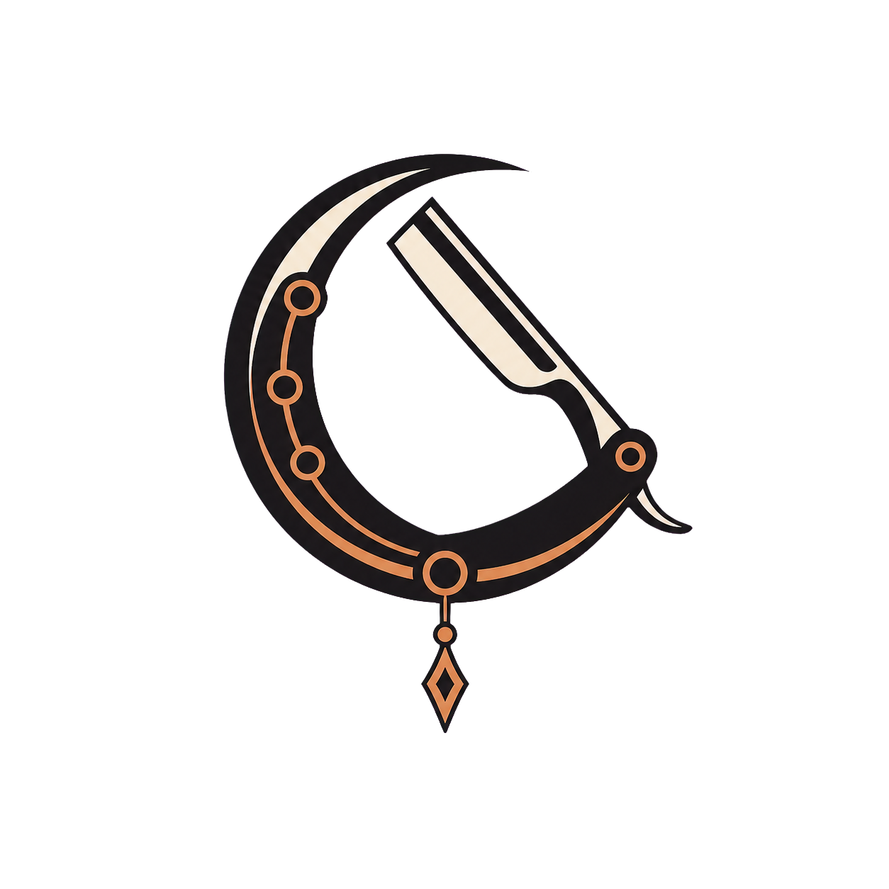
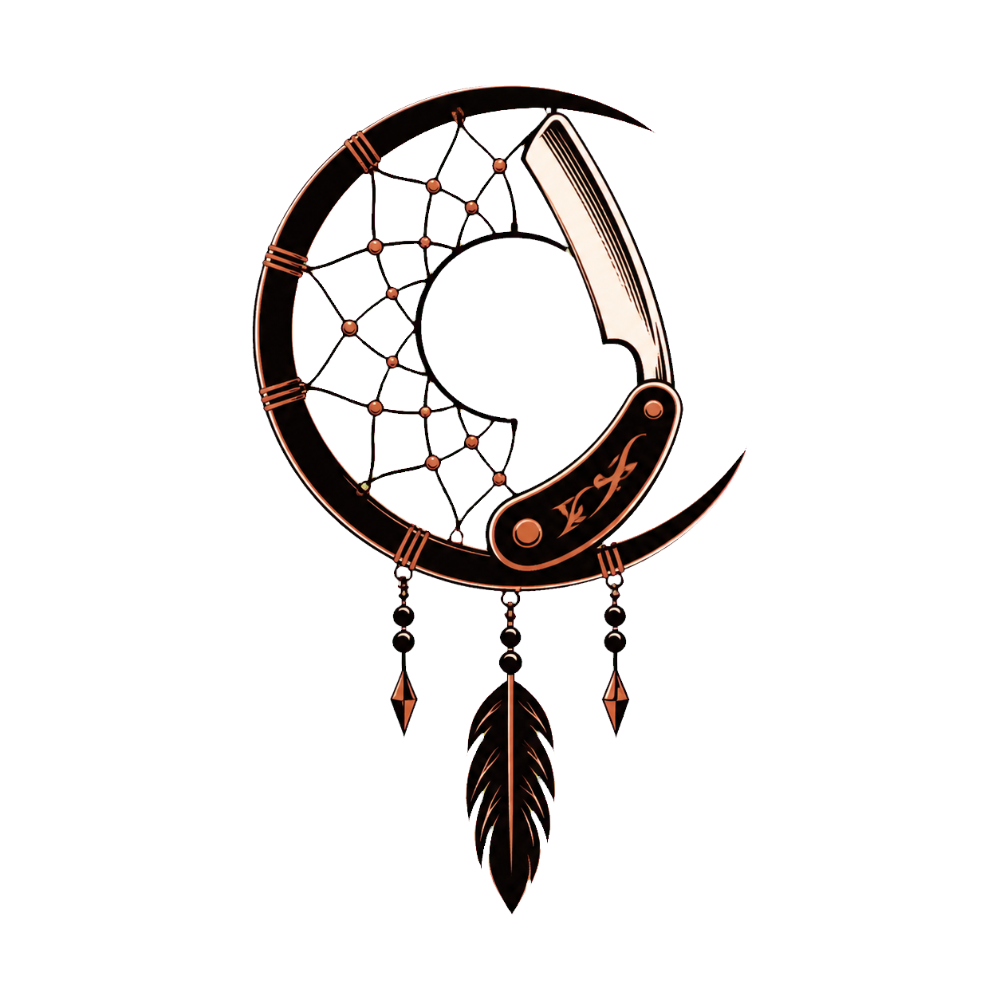
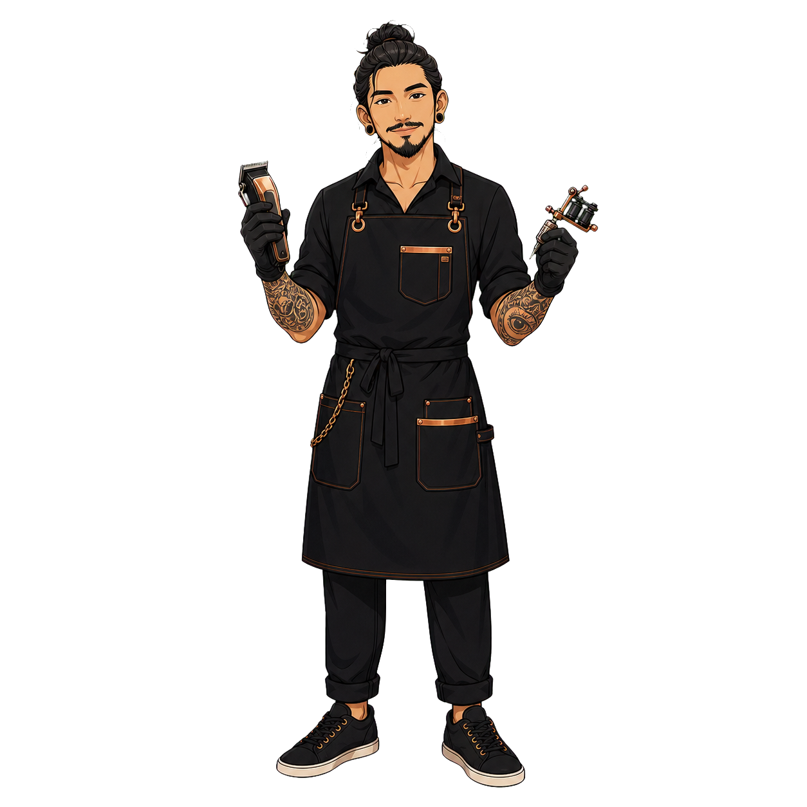

# Brand Assets V1

Generated with the `direct-image-assets` workflow. Each asset was generated as its own standalone image, then copied into the project. Source files are preserved beside transparent PNG outputs.

## Asset Folder

`docs/assets/brand/direct-v1/`

## Files

### Simplified UI Icon

Final transparent PNG:

Path:

- `docs/assets/brand/direct-v1/dream-catcher-logo-icon-v1.png`
- `docs/assets/brand/direct-v1/dream-catcher-logo-icon-v1-source.png`

Specs:

- Role: simplified UI mark / favicon base / compact app icon base
- Size: 1254 x 1254
- Alpha: yes
- Best use: mobile header, loading state, favicon source, compact navigation, early UI prototype
- Caveat: still raster-generated; redraw as SVG/vector before final production identity

Prompt summary:

- Simplified Dream Blade icon
- Bold crescent ring fused with a minimal barber straight razor silhouette
- Three small dreamcatcher bead nodes and one short hanging diamond charm
- No wordmark, web mesh, feather bundle, text, letters, numbers, watermark, skulls, barber pole stripes, religious symbols, or tribal appropriation

### Logo Mark

Final transparent PNG:

Path:

- `docs/assets/brand/direct-v1/dream-catcher-logo-mark-v1.png`
- `docs/assets/brand/direct-v1/dream-catcher-logo-mark-v1-source.png`

Specs:

- Role: primary logo mark exploration asset
- Size: 1254 x 1254
- Alpha: yes
- Best use: booking page identity, large header mark, brand exploration, early UI mockups
- Caveat: too detailed for final favicon/app icon; simplify before production vector work

Prompt summary:

- Simplified Dream Blade symbol
- Crescent dreamcatcher ring fused with barber straight razor edge
- Black ink linework with restrained copper accent
- No text, wordmark, letters, numbers, watermark, skulls, barber pole stripes, religious symbols, or tribal appropriation

### Mascot Artist

Final transparent PNG:

Path:

- `docs/assets/brand/direct-v1/dream-catcher-mascot-artist-v1.png`
- `docs/assets/brand/direct-v1/dream-catcher-mascot-artist-v1-source.png`

Specs:

- Role: mascot / studio guide for UI
- Size: 1254 x 1254
- Alpha: yes
- Best use: booking confirmation, empty states, tattoo request handoff, welcome section, social preview
- Caveat: tool details are high-detail; use at medium or large sizes first

Prompt summary:

- Calm Thai/Southeast Asian barber and tattoo artist mascot
- Black work apron with copper trim
- Holding barber clippers and tattoo machine
- Professional, welcoming, not aggressive or childish
- No text, letters, logos, watermark, skulls, horror mood, biker-gang aesthetic, blood, religious symbols, or tribal appropriation

## Generation Method

1. Generated each asset individually with image generation.
2. Used a flat green chroma-key source background.
3. Copied original generated files into the workspace.
4. Removed chroma-key background with the imagegen helper.
5. Verified output dimensions and alpha channel with `sips`.

## UI Usage Notes

- Use the simplified UI icon as the default mark in UI mockups.
- Use the logo mark primarily on light, ivory, or warm gray surfaces because much of the mark is black.
- Use the mascot at medium/large sizes where tattoo and tool details remain readable.
- For favicon/app icon, create a simplified mark derived from this logo rather than scaling this full detailed version down.
- For dark-mode UI, create an inverted or light-stroke logo variant before production use.
