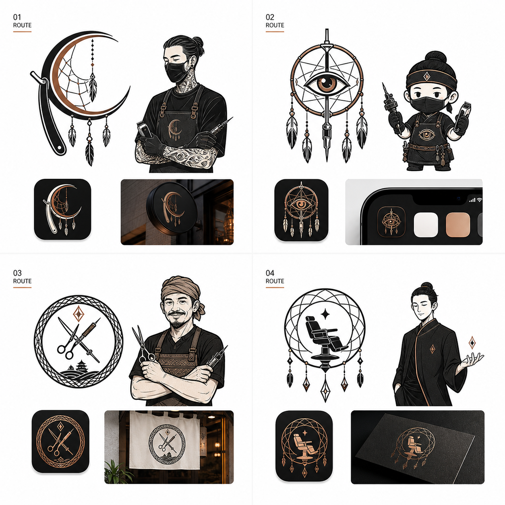

# Brand Identity Directions

## Purpose

เอกสารนี้ใช้เก็บ direction สำหรับ logo และ mascot ของ Dream Catcher Barber and Tattoo ก่อนเริ่มออกแบบ UI จริง

Generated concept board:

## Brand Anchor

- Brand name: Dream Catcher Barber and Tattoo
- Category: local barber and tattoo studio
- First product use: booking web app สำหรับร้านนี้
- Audience: ลูกค้าในพื้นที่เชียงใหม่/สันกำแพงที่จองคิวผ่านมือถือ และเจ้าของร้านที่ใช้ admin dashboard
- Personality: เท่, จริงจัง, เป็นงานฝีมือ, เข้าถึงง่าย, ไม่ดุหรือมืดจนลูกค้าทั่วไปกลัว

## Visual Principles

- ใช้ได้ทั้งหน้าร้าน, app icon, booking page, social avatar, sticker, และ admin UI
- Mark ต้องอ่านง่ายเมื่อย่อเล็ก
- Mascot ต้องเป็น studio guide ไม่ใช่ cartoon mascot ที่เด็กเกินไป
- Mood ควรเป็น hybrid: ลูกค้าใช้ง่าย แต่ยังมี character ของ barber/tattoo studio
- สีหลักควรเริ่มจาก off-black, warm gray, ivory/white, และ copper accent

## Route 1: Dream Blade

Core idea:

- วง dreamcatcher + crescent + ใบมีดโกน
- เชื่อม barber กับชื่อ Dream Catcher ได้ชัดที่สุด

Best for:

- Primary logo mark
- App icon
- Booking page hero
- Shop signage direction

Mascot direction:

- ช่าง/artist ใส่ apron และ mask
- ดูนิ่ง มืออาชีพ และเหมาะกับทั้งตัดผม/สัก

Watch out:

- รายละเอียด dreamcatcher/feather ต้องลดลงมากตอนทำ vector จริง
- หลีกเลี่ยงให้ดูเหมือนเครื่องรางหรือสัญลักษณ์เชิงศาสนา

Recommendation:

- Strong candidate สำหรับ route หลักของ brand

## Route 2: Ink Guardian

Core idea:

- eye + dreamcatcher + tattoo needle geometry
- เน้นฝั่ง tattoo มากกว่า barber

Best for:

- Tattoo request section
- Mascot sticker
- Secondary identity element

Mascot direction:

- ตัวละคร studio guardian ถือเครื่องมือสัก/clipper
- เหมาะกับ LINE sticker หรือ state illustration

Watch out:

- ตา + เข็มอาจดู intense เกินไปสำหรับลูกค้าที่เข้ามาจองตัดผม
- ถ้าใช้เป็น main logo อาจทำให้ร้านดู tattoo-only

Recommendation:

- ใช้เป็น secondary route หรือ mascot-only exploration

## Route 3: San Kamphaeng Craft

Core idea:

- craft badge รวม scissors, needle, woven ring และ local cue
- ให้ความรู้สึกเป็นร้าน local craft

Best for:

- Stamp, merchandise, shop signage, apron patch
- Brand application ที่ต้องการความ local และเป็นงานฝีมือ

Mascot direction:

- ช่างท้องถิ่นที่ดูเป็นมิตรและไว้ใจได้

Watch out:

- Badge มีรายละเอียดเยอะ อาจไม่เหมาะกับ app icon
- เสี่ยงดูเป็นร้าน craft/gift shop มากกว่า barber booking app

Recommendation:

- เก็บไว้เป็น supporting graphic หรือ merchandise route

## Route 4: Night Chair

Core idea:

- barber chair silhouette อยู่ใน dreamcatcher geometry
- premium, minimal, และ UI-friendly

Best for:

- App icon
- Admin UI brand mark
- Premium dark-mode visual system
- Business card / appointment card

Mascot direction:

- studio host ที่ดูนิ่ง เรียบ และพรีเมียม
- ไม่ใช่ mascot ตลก แต่เป็น guide ของระบบ

Watch out:

- Barber chair อาจทำให้ฝั่ง tattoo หายไปถ้าไม่มี secondary graphic
- ต้องทำให้ mark ไม่คล้าย generic barbershop icon

Recommendation:

- Strong candidate สำหรับ UI system และ app icon

## Recommended Direction

แนะนำให้ไปต่อด้วยการผสม:

- Primary logo: Route 1 `Dream Blade`
- UI/app icon refinement: Route 4 `Night Chair`
- Mascot base: Route 1 แบบช่าง/artist ที่ดู calm และ professional
- Secondary tattoo illustration: Route 2 `Ink Guardian`

## Production Notes

- Concept board เป็น AI-generated raster image ใช้เพื่อเลือก direction เท่านั้น
- Wordmark/text ในภาพยังไม่ควรถือว่า final
- ขั้นตอนถัดไปควรทำ vector-friendly logo sketch โดยลดรายละเอียดให้เหลือ mark ที่ scale ได้
- ก่อนใช้เชิงพาณิชย์ควรทำ trademark/style similarity review

