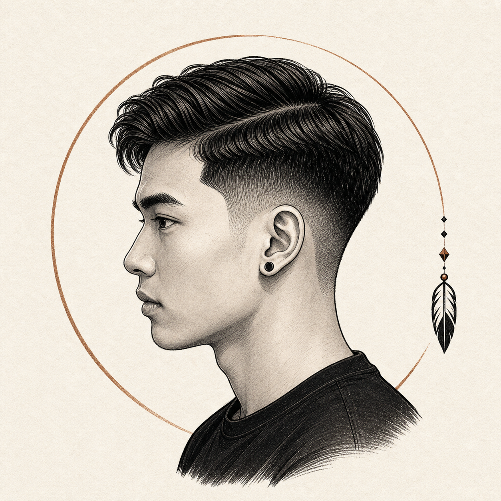
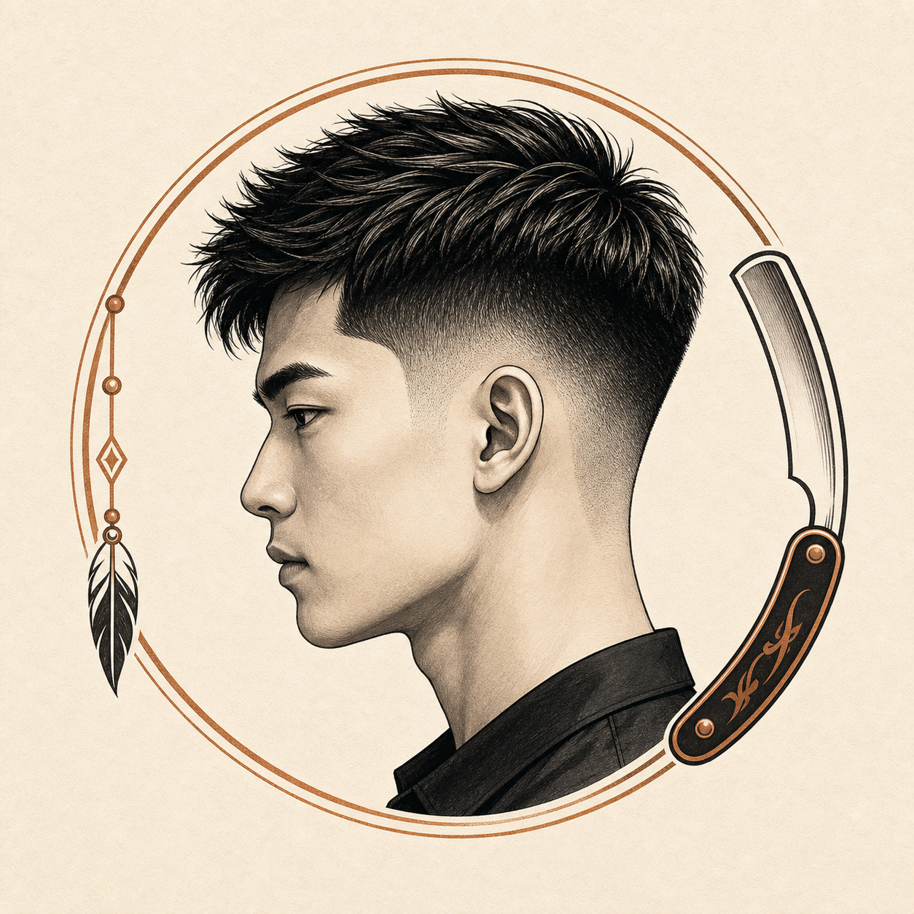
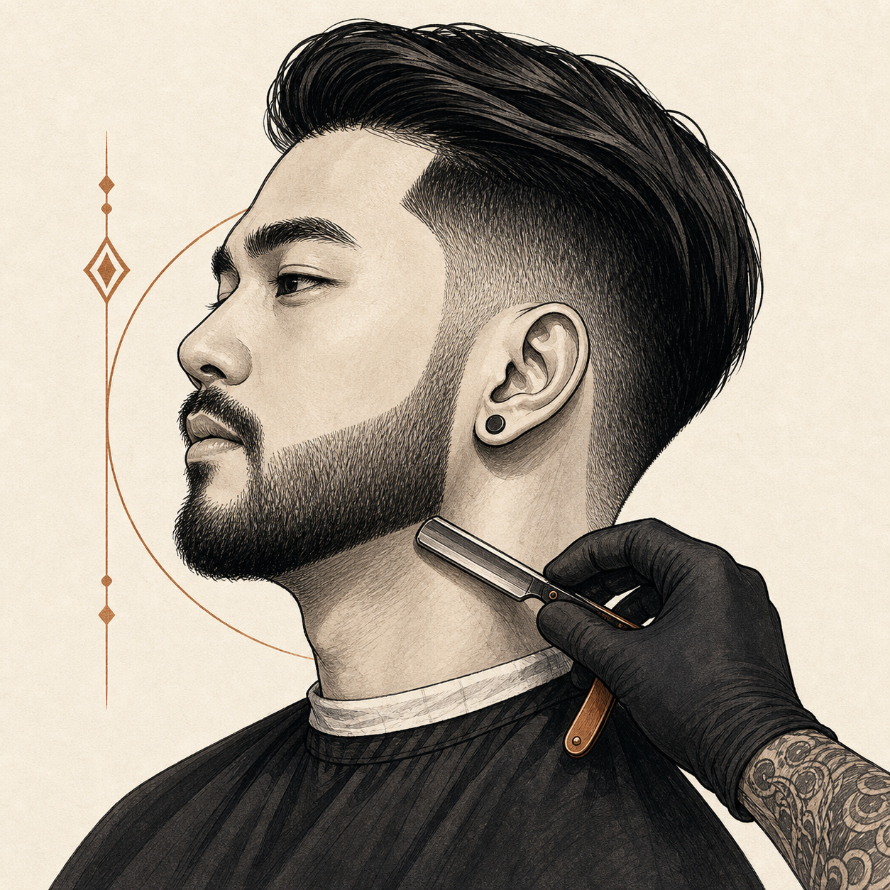
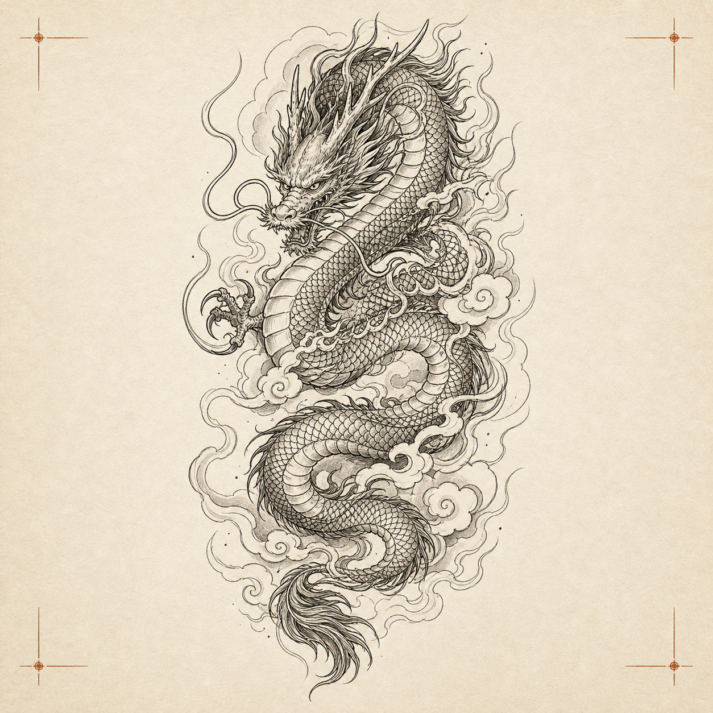
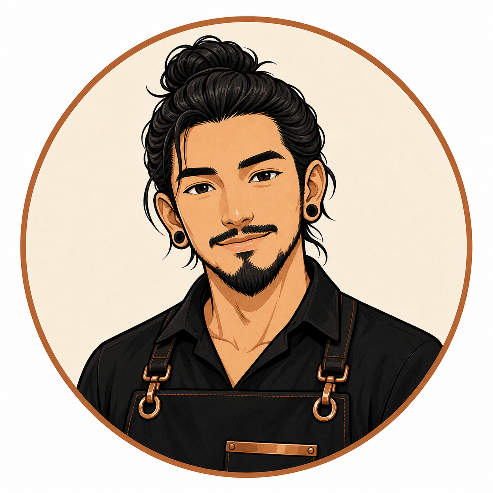

# UI Assets V1

Generated with the `direct-image-assets` workflow. Each asset is a standalone generated file copied into the project. No contact sheets or crops from UI mockups were used.

## Asset Folder

`docs/assets/ui-assets/direct-v1/`

## Service Thumbnails

Use these in customer booking service cards, recommended services, and mock data.

### Classic Haircut

- Path: `docs/assets/ui-assets/direct-v1/services/service-classic-haircut.png`
- Role: men's classic haircut service thumbnail
- Size: 1254 x 1254

### Modern Fade

- Path: `docs/assets/ui-assets/direct-v1/services/service-modern-fade.png`
- Role: fade haircut service thumbnail
- Size: 1254 x 1254

### Beard Trim

- Path: `docs/assets/ui-assets/direct-v1/services/service-beard-trim.png`
- Role: beard trim / grooming service thumbnail
- Size: 1254 x 1254

### Tattoo Consult Rose

- Path: `docs/assets/ui-assets/direct-v1/services/service-tattoo-consult-rose.png`
- Role: tattoo consultation service thumbnail
- Size: 1254 x 1254

## Tattoo Reference Placeholders

Use these only as UI placeholders for tattoo request review, upload previews, or mock data. They are not final tattoo designs.

### Dragon Linework

- Path: `docs/assets/ui-assets/direct-v1/tattoo-references/reference-dragon-linework.png`
- Role: tattoo request reference placeholder
- Size: 1254 x 1254

### Floral Fineline

- Path: `docs/assets/ui-assets/direct-v1/tattoo-references/reference-floral-fineline.png`
- Role: tattoo request reference placeholder
- Size: 1254 x 1254

### Geometric Crescent

- Path: `docs/assets/ui-assets/direct-v1/tattoo-references/reference-geometric-crescent.png`
- Role: tattoo request reference placeholder using brand-adjacent geometry
- Size: 1254 x 1254
- Caveat: close to the brand motif; avoid using it as a real client tattoo design without owner review

## Staff Avatars

Use these in admin queue cards, staff selectors, and mock data.

### Arm

- Path: `docs/assets/ui-assets/direct-v1/staff/staff-arm-avatar.png`
- Role: primary staff avatar
- Size: 1254 x 1254

### Boss

- Path: `docs/assets/ui-assets/direct-v1/staff/staff-boss-avatar.png`
- Role: secondary/future staff avatar
- Size: 1254 x 1254

## State Illustrations

Use these sparingly in large UI states. Do not use them inside dense admin queue rows.

### Booking Confirmed

- Path: `docs/assets/ui-assets/direct-v1/states/state-booking-confirmed.png`
- Role: booking confirmation or request received state
- Size: 1254 x 1254

### Empty Queue

- Path: `docs/assets/ui-assets/direct-v1/states/state-empty-queue.png`
- Role: admin empty queue / quiet day state
- Size: 1254 x 1254
- Caveat: detailed; use at medium or large size

## Usage Rules

- Use these assets as UI prototype assets first; production visual identity can be refined later.
- Do not extract logo marks from these generated assets; use `docs/assets/brand/direct-v1/` for logo/icon/mascot.
- Keep service thumbnails in cards with stable aspect ratio so rows do not shift.
- Avoid placing generated images behind important text.
- If the frontend app is scaffolded later, copy these into the app's public asset folder instead of linking directly from `docs/`.

