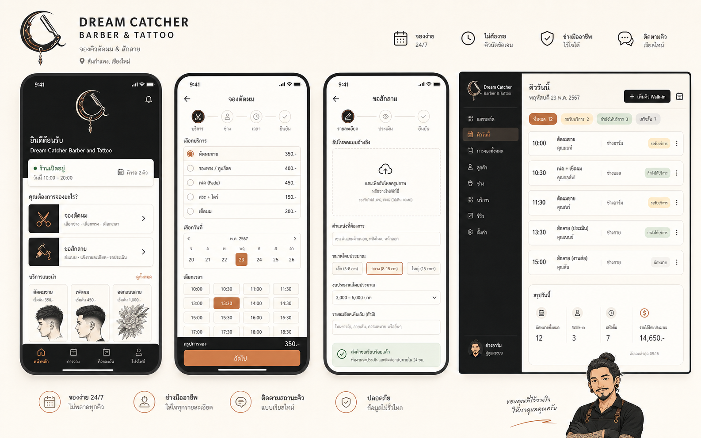

# UI Concept V1

Generated UI direction for the first Dream Catcher booking prototype.

## Concept Scope

This image explores the first UI direction for:

- Customer booking start screen
- Haircut booking flow
- Tattoo request flow
- Admin daily queue preview

## What To Carry Forward

- Mobile-first customer flow
- Warm ivory customer UI with restrained copper CTA
- Simplified logo icon as the default UI mark
- Two clear entry points: haircut booking and tattoo request
- Haircut flow split into service, date, time, confirmation steps
- Tattoo request flow with upload area and structured details
- Admin dashboard focused on daily queue, not monthly calendar
- Mascot used sparingly as a supporting visual, not as repeated decoration

## What Not To Treat As Final

- Generated Thai copy is not final and may be inaccurate
- Exact prices, service names, times, and dates are placeholders
- UI spacing and component sizes need to be rebuilt directly in frontend
- Logo and mascot should use the saved project assets, not be cropped from this concept image
- Admin data is mock data only

## Implementation Notes

- Use `docs/brand-ui-spec.md` as the source of truth for colors and component behavior.
- Use `docs/assets/brand/direct-v1/dream-catcher-logo-icon-v1.png` as the compact UI mark.
- Use `docs/assets/brand/direct-v1/dream-catcher-mascot-artist-v1.png` only for confirmation, empty state, or tattoo handoff screens.
- Recreate screens as real UI instead of slicing this concept image.

