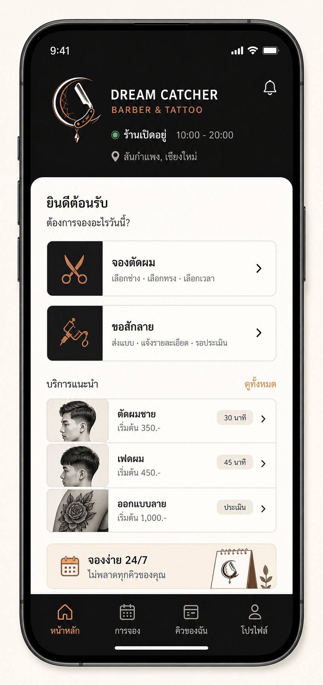
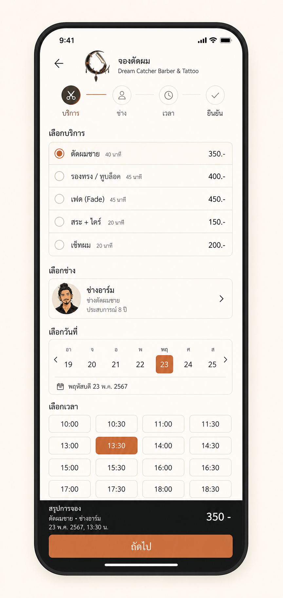
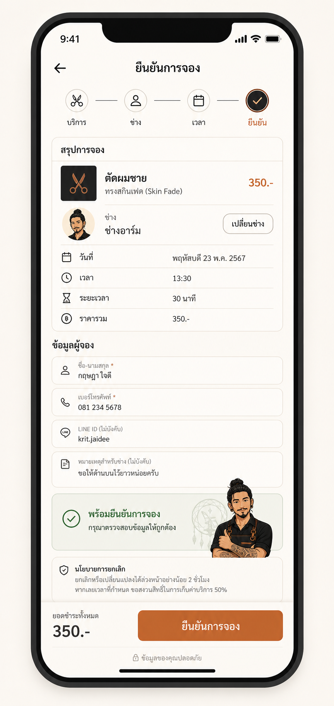
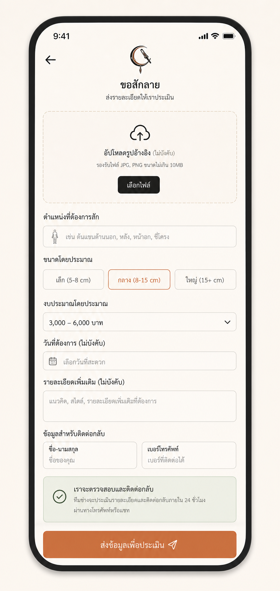
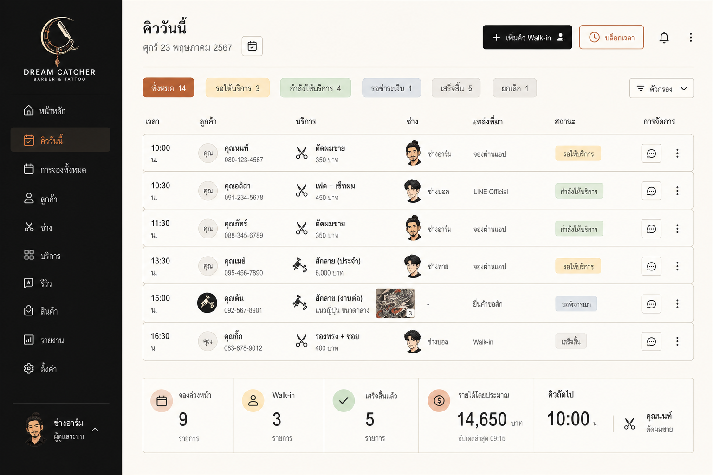
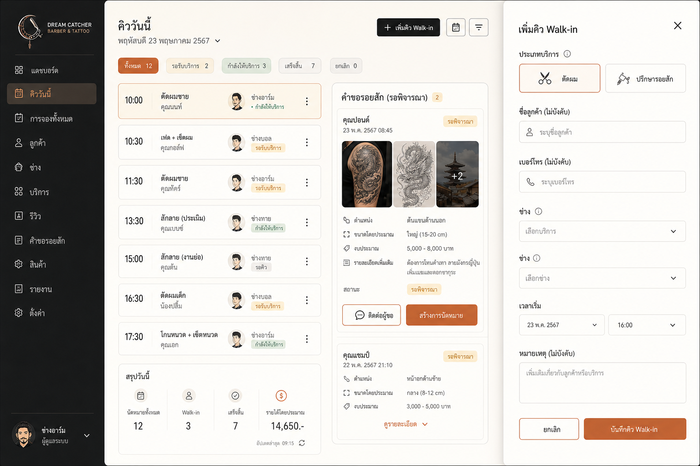

# UI Pages V1

ชุดภาพนี้แยกจาก UI concept board ออกมาเป็น page-level references สำหรับ frontend prototype รอบแรก

## 01 Customer Home

Purpose:

- หน้าแรกสำหรับลูกค้า
- เลือก flow หลัก: จองตัดผม หรือ ขอประเมินงานสัก
- แสดงสถานะร้าน บริการแนะนำ และทางเข้าคิวของฉัน

Implementation notes:

- ใช้ simplified icon ใน header
- CTA สองเส้นทางต้องชัดกว่า service list
- Service recommendations เป็น secondary content

## 02 Haircut Booking

Purpose:

- เลือกบริการตัดผม
- เลือกวันและเวลา
- เห็นราคาก่อนกดยืนยันขั้นต่อไป

Implementation notes:

- Time slot grid ต้อง thumb-friendly
- Selected state ใช้ copper
- Sticky bottom summary ช่วยลด cognitive load

## 03 Customer Details And Confirm

Purpose:

- ตรวจ booking summary
- กรอกชื่อ เบอร์ LINE และ note
- ยืนยันคิว

Implementation notes:

- Form labels ต้องชัด ไม่ใช้ placeholder อย่างเดียว
- Policy note ต้องสั้นและ practical
- Mascot ใช้ได้เฉพาะ success/confirmation area

## 04 Tattoo Request

Purpose:

- ส่งคำขอสักลายเพื่อให้ร้าน review
- แนบ reference image
- ระบุตำแหน่ง ขนาด งบประมาณ วันที่สะดวก และ note

Implementation notes:

- Upload area ต้องเด่นแต่ไม่กินหน้าทั้งหมด
- ต้องสื่อชัดว่านี่คือ request ไม่ใช่ confirmed appointment
- Form ควรแบ่ง section ให้ scan ง่าย

## 05 Admin Daily Queue

Purpose:

- หน้าหลักของร้าน
- ดูคิววันนี้
- เพิ่ม walk-in
- ดู pending tattoo requests และ summary metrics

Implementation notes:

- Daily queue เป็น primary screen ไม่ใช่ monthly calendar
- Queue item ต้อง prioritize เวลา, service, customer, staff, status
- ใช้ status chips แบบ restraint

## 06 Admin Walk-In And Review

Purpose:

- เพิ่ม walk-in ผ่าน drawer/modal
- Review tattoo request และสร้าง appointment

Implementation notes:

- Drawer form ต้องไม่บัง queue context ทั้งหมดถ้าเป็น desktop
- Walk-in form ต้องรองรับข้อมูล optional
- Tattoo request card ควรมี action ติดต่อผู้ขอและสร้างการนัดหมาย

## Global Notes

- Generated Thai text is directional only and must be rewritten during implementation.
- Prices, times, names, statuses, and dates are placeholder data.
- Recreate the UI as real frontend components; do not slice these images.
- Follow `docs/brand-ui-spec.md` for color, typography direction, asset usage, and component behavior.
- Use actual saved brand assets from `docs/assets/brand/direct-v1/` rather than extracting marks from the mockup images.

